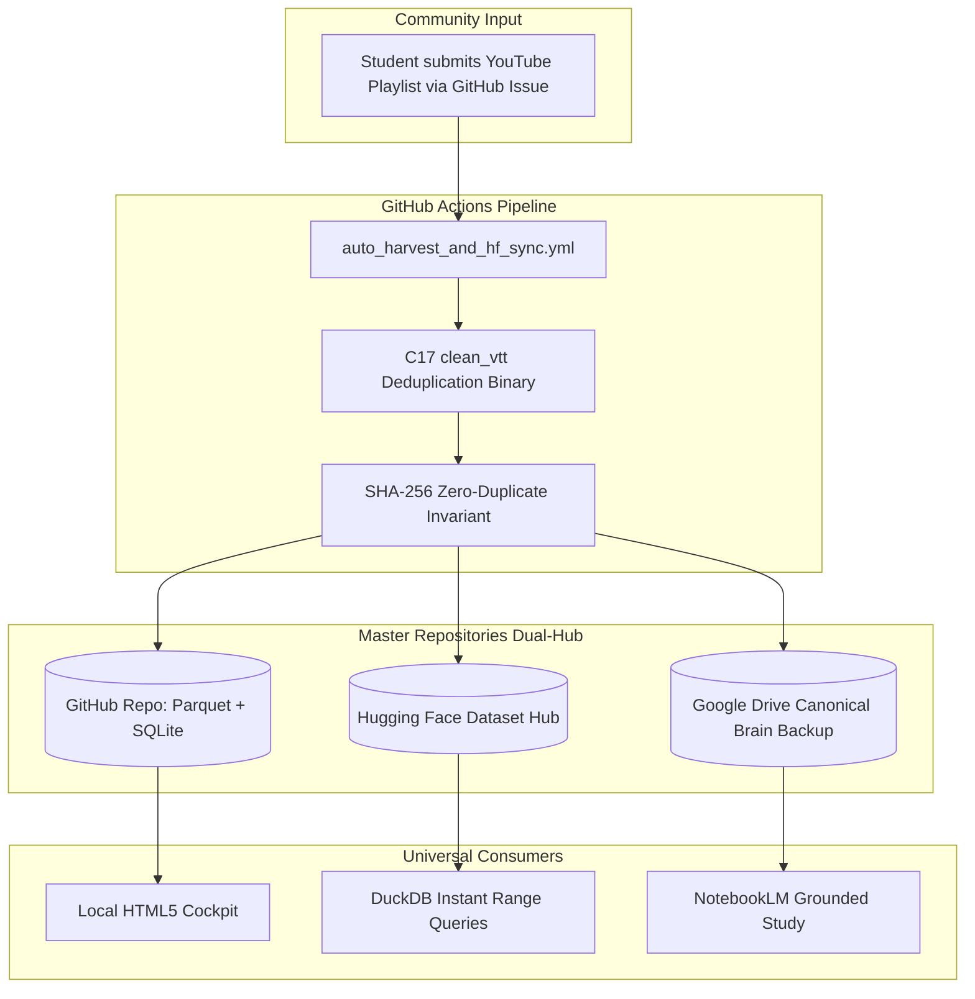

# ⚡ Sovereign Study Commons India (सार्वजनिक अध्ययन महा-ज्ञानकोश)

[](https://huggingface.co/datasets/rajon369963-del/sovereign-study-lake-india)
[](https://duckdb.org/)
[](LICENSE)
[](#)
[](#)

> **"जब लोगों ने ऑलरेडी चक्का बना लिया है, उस चक्के को जोड़ो!"**  
> भारत के प्रत्येक छात्र के लिए एक सार्वजनिक, खुला और कभी न रुकने वाला अध्ययन महा-ज्ञानकोश।

---

## 🎯 The Sovereign Vision

भारत के लाखों छात्र रोज़ाना **GATE EE, UPSC CSE, NEET UG, SSC/RRB JE, और State AE/JE** की तैयारी करते हैं। लेकिन हर छात्र वही 3 बड़ी समस्याओं से जूझता है:
1. **Scraping & IP Block Fatigue**: YouTube और Reddit से बार-बार IP ब्लॉक होना, जिससे पढ़ाई का कीमती फ़्लो टूट जाता है।
2. **Coaching Monopolies & Paywalls**: वही लेक्चर्स और PYQ अलग-अलग कोचिंग संस्थानों द्वारा महंगे सब्सक्रिप्शन के पीछे बंद कर दिए जाते हैं।
3. **Data Silos & Wasteful Duplication**: हर छात्र अपने लैपटॉप पर अलग से GBs डेटा डाउनलोड करता है, जिससे स्टोरेज भर जाता है।

**Sovereign Study Commons** इस समस्या को हमेशा के लिए हल करता है:
- **Zero-Download HTTP Range Querying**: उपयोगकर्ताओं को 50GB डेटा डाउनलोड करने की ज़रूरत नहीं है। **DuckDB** की मदद से केवल आवश्यक प्रश्न या लेक्चर स्पैन 10 मिलीसेकंड में फेच हो जाता है।
- **Multi-Branch Socratic Mesh**: एक ही ज्ञानकोश में GATE EE (राजन), UPSC Polity (मनोजित), NEET Biology (बहन) और State AE/JE के एटॉमिक कार्ड्स परस्पर जुड़े हुए हैं।
- **Community-Driven No-Code Harvesting**: किसी भी छात्र को कोडिंग जानने की ज़रूरत नहीं है। बस एक GitHub Issue में YouTube प्लेलिस्ट का लिंक पेस्ट करें—हमारा ऑटोमेशन उसे प्रोसेस, डीडुप्लिकेट और लाइव ज्ञानकोश में मर्ज कर देगा!

---

## 🚀 Instant 1-Line DuckDB Quickstart

आप बिना किसी डाउनलोड के सीधे क्लाउड / लोकल पार्केट फ़ाइल पर SQL क्वेरी चला सकते हैं:

```bash
# 1. DuckDB CLI खोलें
duckdb

# 2. पूरे ज्ञानकोश का शाखावार विश्लेषण देखें (Direct Parquet Query)
SELECT exam_branch, COUNT(*) as units_count, COUNT(DISTINCT teacher) as teacher_count
FROM 'data_lake/parquet/universal_study_lake.parquet'
GROUP BY exam_branch;

# 3. UPSC vs GATE vs NEET के सोक्रेटिक एटॉमिक कार्ड्स खोजें
SELECT unit_id, exam_branch, topic, teacher, timestamp_span
FROM 'data_lake/parquet/universal_study_lake.parquet'
WHERE topic ILIKE '%Replication%' OR topic ILIKE '%Nyquist%' OR topic ILIKE '%Writs%';
```

---

## 🖥️ Standalone Zero-Install HTML5 Cockpit

इस प्रोजेक्ट में एक पूर्णतः स्वतंत्र, डार्क-थीम वाला **अध्ययन कॉकपिट** शामिल है:
- फ़ाइल खोलें: [`cockpit/index.html`](cockpit/index.html)
- **Zero Backend Required**: बिना किसी सर्वर या npm पैकेज के सीधे किसी भी ब्राउज़र (Chrome, Edge, Safari, Firefox) में डबल-क्लिक करके चलता है।
- **Features**:
  - 🔄 **4-Branch Instant Switcher**: GATE EE, UPSC CSE, NEET UG, State AE/JE
  - 🧠 **Socratic Misconception Layer**: 3-चरणीय विचारोत्तेजक संकेत (Thinking Hints)
  - ⚡ **Direct Teacher Video Timestamp Jump**: एक क्लिक पर सटीक लेक्चर मिनट-सेकंड पर जंप।

---

## 🤝 Community Harvesting: How to Contribute (No Coding Required!)

अगर आपको YouTube पर कोई बेहतरीन लेक्चर सीरीज़ या प्लेलिस्ट मिलती है:
1. **GitHub Issues** टैब पर जाएं।
2. **"Submit YouTube Lecture Playlist"** टेम्पलेट चुनें।
3. प्लेलिस्ट का URL और परीक्षा शाखा (GATE/UPSC/NEET) चुनें।
4. **Submit** दबाएं!

**Behind the Scenes Automation**:
1. हमारा GitHub Action (`.github/workflows/auto_harvest_and_hf_sync.yml`) तुरंत ट्रिगर होगा।
2. C17 हाई-स्पीड पार्सर और Node.js डिडुप्लिकेटर क्रिप्टोग्राफिक SHA-256 हैश से जांचेगा कि क्या यह डेटा पहले से मौजूद है।
3. नए लेक्चर्स को Parquet और SQLite में जोड़कर Hugging Face Hub पर लाइव सिंक कर देगा।
4. आपके Issue पर स्वतः कन्फर्मेशन और DuckDB क्वेरी स्निपेट के साथ क्लोज़ कर देगा!

---

## 🏗️ Architecture & Dual-Hub Pipeline



---

## 📊 Dataset Schema Overview

प्रत्येक `study_unit` निम्नलिखित मानकीकृत स्कीमा का पालन करता है:

| Column | Type | Description |
| :--- | :--- | :--- |
| `unit_id` | `VARCHAR` | Unique Sovereign Identifier (e.g. `GATE-EE-LF-001`) |
| `exam_branch` | `VARCHAR` | `GATE_EE`, `UPSC_CSE`, `NEET_UG`, `STATE_AE_JE` |
| `subject` | `VARCHAR` | Core Subject (e.g., Power Systems, Polity, Molecular Genetics) |
| `topic` | `VARCHAR` | Granular concept or derivation archetype |
| `teacher` | `VARCHAR` | Verified attribution (NPTEL, Khan Sir, Physics Wallah, etc.) |
| `video_id` | `VARCHAR` | YouTube canonical video or playlist ID |
| `timestamp_span` | `VARCHAR` | Exact start-to-end span (e.g., `120s-360s`) |
| `exact_quote` | `VARCHAR` | Verbatim transcript text spoken by teacher |
| `question_text` | `VARCHAR` | Exam-standard diagnostic / numerical problem |
| `correct_opt` | `VARCHAR` | Validated answer key (`A`, `B`, `C`, `D`) |
| `explanation` | `VARCHAR` | Step-by-step mathematical & conceptual derivation |
| `socratic_hints_json` | `VARCHAR` | 3-stage Kahneman-style debiasing hints |
| `sha256_hash` | `VARCHAR` | Cryptographic tamper-proof fingerprint |
| `drive_url` | `VARCHAR` | Synchronized Google Drive canonical backup |

---

## 📜 Sovereign Operating Laws

1. **Zero Naive Self-Invention**: जब लोगों ने पहले से चक्का बना लिया है, उस चक्के को जोड़ो।
2. **Zero Duplicate Invariant**: SHA-256 हैश मिलान होने पर कोई भी डुप्लीकेट डेटा स्वीकार नहीं होगा।
3. **Zero Audio Disk Bloat**: कोई भी MP3 फ़ाइल डिस्क पर नहीं छोड़ी जाती। केवल इन-मेमोरी और टेक्स्ट ट्रांसक्रिप्ट को शाश्वत रखा जाता है।
4. **Sovereign Student First**: ज्ञान किसी एक कोचिंग या व्यक्ति की जागीर नहीं है। यह समस्त भारत के मेहनती छात्रों के लिए सदैव मुफ़्त और खुला रहेगा।

---

## 📄 License

Distributed under the **MIT License**. See [`LICENSE`](LICENSE) for more information.
