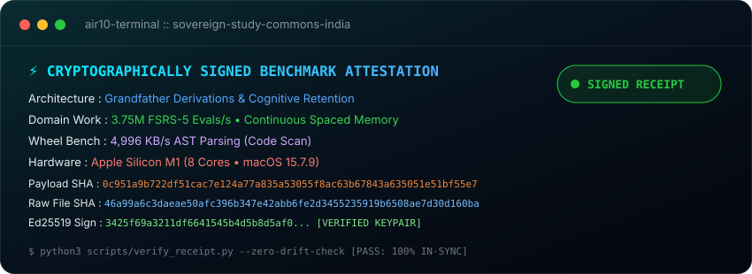

[](./llms.txt)
[](./llms.txt)
[](https://rajon369963-del.github.io/sovereign-study-commons-india/)

<p align="center">
  
</p>


# ⚡ Sovereign Study Commons India (सार्वजनिक अध्ययन महा-ज्ञानकोश)

> भारत के छात्रों के लिए a public, open study-data commons. Repository truth is strictly preferred over intended future state.

## Live truth status — verified 10 Sep 2026

Every operational and dataset claim is explicitly classified:

- **`[VERIFIED]` GitHub repository:** public and readable at `https://github.com/rajon369963-del/sovereign-study-commons-india`.
- **`[VERIFIED]` Dataset assets & manifest:** committed Parquet and SQLite lake assets match physical SHA-256 hashes and row counts verified via [`data_lake/dataset_manifest.json`](data_lake/dataset_manifest.json) and [`scripts/verify_dataset_manifest.py`](scripts/verify_dataset_manifest.py).
- **`[VERIFIED]` Integrity CI automation:** `.github/workflows/data-integrity.yml` and `.github/workflows/sha256-idempotency-canary.yml` are active on the default branch. These are bounded integrity checks; they do not prove persistent semantic-identity migration or learner value.
- **`[VERIFIED_BOUNDED]` Real DuckDB CLI regression:** `.github/workflows/duckdb-cli-smoke.yml` installs the pinned DuckDB CLI `1.5.5`, verifies the downloaded archive SHA-256, and runs `scripts/test_duckdb_smoke_test.py` against committed Parquet assets on relevant pull requests/pushes. A successful run proves this bounded CLI/query path, not dataset provenance, redistribution rights, hub parity, or learner value.
- **`[VERIFIED_BOUNDED]` Public Pages endpoint smoke:** `.github/workflows/pages-endpoint-smoke.yml` has physically executed an unauthenticated external GET from GitHub Actions and passed HTTP 200, the stable `Sovereign Study Commons India` title marker, and stale unsafe-marker rejection. This proves bounded endpoint reachability/content truth only, **not** browser E2E, mobile/accessibility, JavaScript interaction correctness, or learner value.
- **`[VERIFIED_BOUNDED]` Pages periodic execution evidence:** genuine `schedule` run `34438435547` succeeded on default-branch SHA `cb6b9bed16166db1c3db2b7718bde22e084d5d41`. This proves the bounded periodic mechanism at that exact revision only, **not** a permanent freshness state or SLA. Current freshness must always be recomputed by comparing the newest genuine scheduled-success SHA with the then-current default-branch SHA; any later `main` advance makes the older run historical evidence only.
- **`[VERIFIED]` Review-only intake boundary:** default-branch repository bytes contain the evidence-first bug/data-integrity/provenance Issue Form plus the lecture-review form. Issue-form structure is submission-time structure, not immutable evidence; real triage usefulness remains unvalidated until external traffic exists.
- **`[STAGED]` Harvest & Hugging Face automation:** `workflows_template/auto_harvest_and_hf_sync.yml` remains a **staged template**, not an active GitHub Actions workflow.
- **`[UNVERIFIED]` Remote Hugging Face sync:** live automated syncing to Hugging Face datasets remains unverified until end-to-end authenticated upload, readback, and hash parity succeed.

## Try it now (< 60 seconds)

Prerequisites: `python3` and the DuckDB CLI must already be available in `PATH`. The repository's bounded CI court is pinned to DuckDB CLI **`1.5.5`**. Before treating a local result as CI-equivalent, run `duckdb --version`: version `1.5.5` is **`EXACT_CI_VERSION_REPRODUCTION`**; any other version is an **`OTHER_VERSION_COMPATIBILITY_PROBE`** and remains **`COMPATIBILITY_UNVERIFIED`** relative to the CI-tested path.

Then run these three local verification commands; they do not upload data or require a hosted service:

```bash
# 0. Record the local DuckDB version and claim scope
duckdb --version

# 1. Run DuckDB smoke queries against committed Parquet assets
./scripts/duckdb_smoke_test.sh

# 2. Verify physical SHA-256 hashes and row counts against dataset manifest
python3 scripts/verify_dataset_manifest.py

# 3. Verify fail-closed content identity decisions against adversarial fixtures
python3 scripts/content_identity_oracle.py --check-expected fixtures/content_identity_v1_adversarial.json
```

To regression-test DuckDB CLI detection and query-error handling (requires `python3` and the DuckDB CLI):

```bash
python3 scripts/test_duckdb_smoke_test.py
```

A successful run on a different DuckDB version is useful compatibility evidence, but it must not be reported as reproducing the pinned `1.5.5` CI court unless the exact version boundary is satisfied.

## Quick local query (DuckDB)

If you have DuckDB installed, query a local Parquet artifact directly:

```sql
SELECT exam_branch, COUNT(*) AS units_count
FROM 'data_lake/parquet/universal_study_lake.parquet'
GROUP BY exam_branch;
```

This command is intentionally local and reproducible; it does not depend on remote endpoints. Its result inherits the same version scope above: only DuckDB CLI `1.5.5` is CI-equivalent evidence; other versions are compatibility probes.

## Cockpit

A standalone HTML artifact is available at [`cockpit/index.html`](cockpit/index.html). Public endpoint reachability has bounded automated evidence as described above; interactive browser correctness and learner utility remain separate verification gates.

## Contributing

Start with [`CONTRIBUTING.md`](CONTRIBUTING.md) and [`docs/CONTENT_IDENTITY_V1.md`](docs/CONTENT_IDENTITY_V1.md). All pull requests require evidence-backed verification per [`.github/pull_request_template.md`](.github/pull_request_template.md).

For playlist/study-source proposals, use the repository issue template. Maintainers review submissions before ingestion. Do not upload copyrighted material unless redistribution rights are clear, and never include private learner data, harvested contacts, credentials, tokens, or secrets.

## Automation safety gate

The staged harvest/Hugging Face workflow must **not** be moved into `.github/workflows/` until all of the following are verified: YAML syntax, event filtering, least-privilege permissions, untrusted issue-body handling, dependency/version pinning, token/secret gating, dry-run behavior, rollback, and a bounded canary.

## Data-quality principles

1. **Reuse before rebuild:** use/fork/adapt proven wheels before inventing another system.
2. **Provenance first:** record source URL, title, publisher/teacher, retrieval date, and license/usage status when known.
3. **No synthetic-to-human promotion:** synthetic fixtures can test mechanics; they do not prove learner value.
4. **No private-data harvesting:** zero harvested contacts, credentials, or unsolicited learner outreach.
5. **Truth-correct docs:** claims about counts, deployments, syncs, or performance require reproducible evidence.

## License

Distributed under the **MIT License**. See [`LICENSE`](LICENSE).
